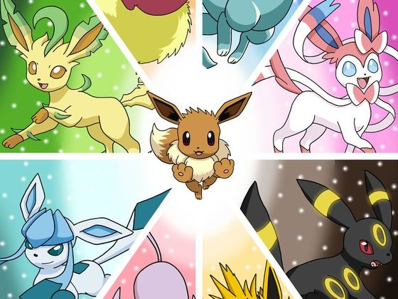
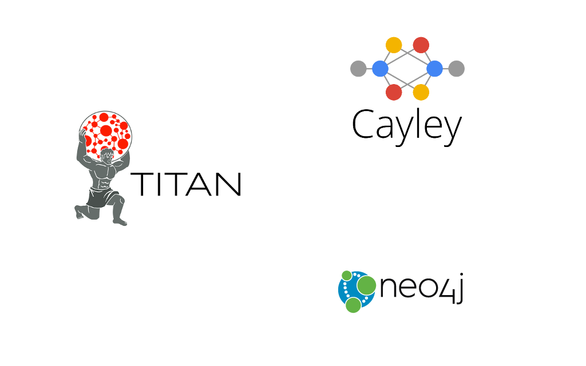
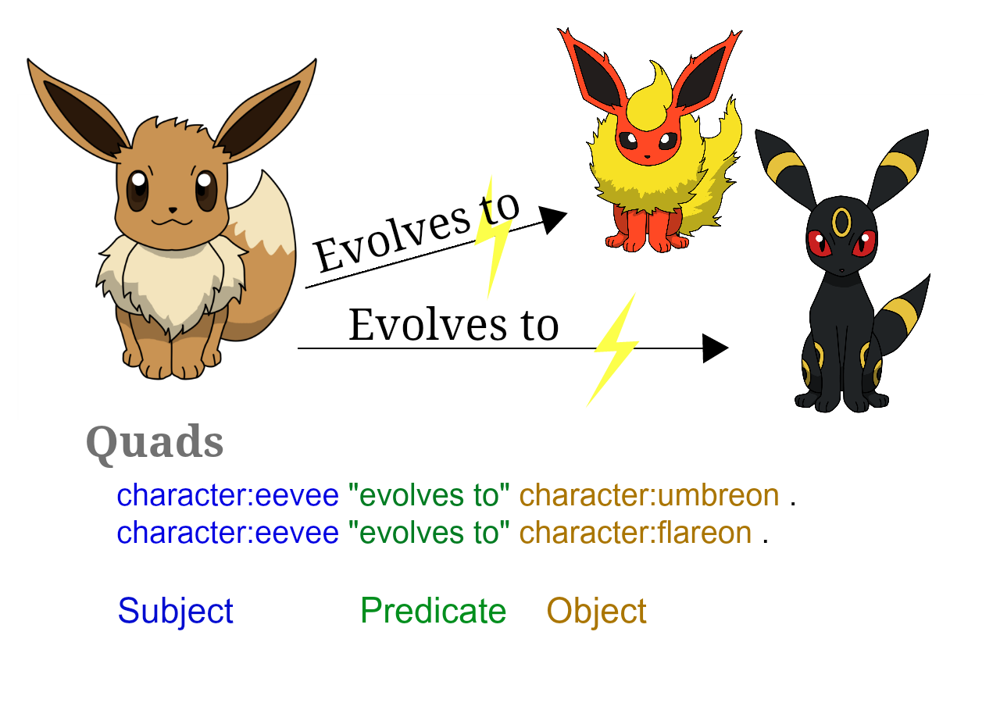
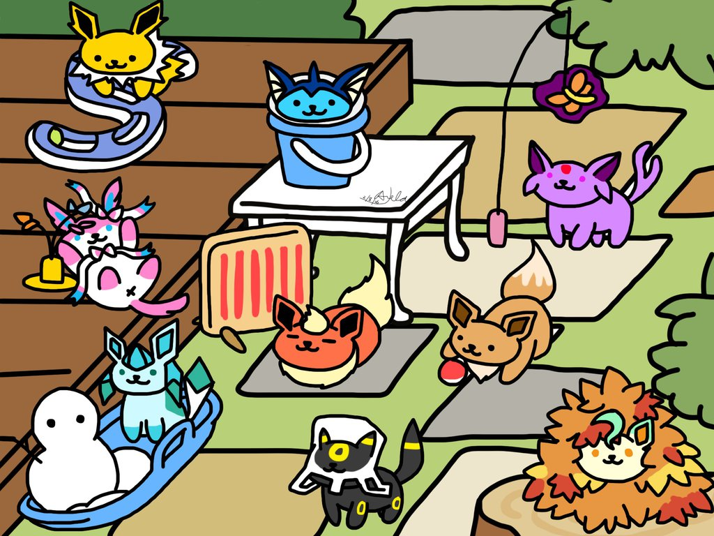

<!-- page_number: true -->

# Evolving Graphs and Pokemon



---

Data modeling is hard.  Often you are presented with the challenge of data modeling at the start of a project, when you are least able to make good decisions about how to model that data.  Using the [Cayley](https://github.com/cayleygraph/cayley) graph database can ease the upfront design and allow you a “schema-last” or “schema-later” approach.

This talk follows our journey of trying to model and understand the Pokemon (generation 1) data and build a small web application and graph database around it.  The web application allows querying and visualization of stats, types, locations, breeding, evolutions, and various other attributes and is available at the Github link.

The talk focuses on the realities of working with unfamiliar data and improving your model as you improve your understanding of the data.  Rather than focusing on the end result, it focus on all the steps and missteps it took to get there and what we learned along the way.


---

# About us


---

# I love feedback!

---


---

# Agenda

- Intro to graph databases
- RDF & Quads
- Modeling Pokemon with Cayley

---

# Intro to graph databases

---

## What is a graph?


A set of vertices and edges (or node and relationships)

---

## What is a graph *database*?


It is a structured way of storing and accessing a graph.

---

## Why graph database?

- Relationship
- Whiteboard friendly
- Performance
- Flexibility

---

## graph dbs VS relational dbs

---


---


---


---


---


---


---



---

# RDF & Quads

---

## What is an *RDF* graph database?

RDF is just how the data is stored.  It is a **"Resource Description Framework"**.


---

You can consider Cayley as being made up of two parts.  **Quads** (RDF Quads) representing the data, and **Queries** representing how to get data back from those quads. 

---



---

## Example


Example of 3 quads:

    Bob     "Listens To"   "Rock Music"   . 
    Bob      Drives         BMW           . 
    Julie   "Listens To"   "Rock Music"   . 
    
Quad format:

    Subject  Predicate      Object

---

## Gotcha 1: Directionality

```Bob -> Listens To -> Rock Music```

but... 

Rock Music never Listens To Bob ... because Rock Music is a bad friend. 

---

## Gotcha 2: Duplicate quads

Duplicate quads make no sense, as they are already completely stored.  You can either ignore them or error on them depending on data expectations.


---

## Queries

A query is how we get data back from the database, Cayley support multiple query systems. The most common one is Gizmo which is a full JavaScript implementation.

 

`g.V("Bob").Out("Listens To").All();` 

would return **Rock Music**.

---

## Breathe

You are doing great!
At this point, we know enough to be dangerous.

---

#  Modeling Pokemon with Cayley

---

## Our plan:

1. [Import Pokemon from CSV into Cayley](https://github.com/oren/pokemon/blob/v0/main.go)
2. [Query and display all Pokemon](https://github.com/oren/pokemon/blob/v1/main.go#L68-L88)
3. [Add uniqueness](https://github.com/oren/pokemon/blob/v3/main.go#L63-L69)
4. [Update a quad](https://github.com/oren/pokemon/blob/v3/main.go#L72-L90)
5. [Show evolution of Pokemon](https://github.com/oren/pokemon/blob/v4/pokemon.go#L121-L140)
6. [Make our graph an RDF](https://github.com/oren/pokemon/blob/v5/pokemon.go#L62-L69)

---

**Step 1.** [Import Pokemon from CSV into Cayley](https://github.com/oren/pokemon/blob/v0/main.go)

https://github.com/PokeAPI/pokeapi/tree/master/data/v2/csv


---

**Step 1.** Import Pokemon from CSV into Cayley

https://github.com/PokeAPI/pokeapi/tree/master/data/v2/csv


---

**Step 5.** [Show evolution of Pokemon](https://github.com/oren/pokemon/blob/v4/pokemon.go#L121-L140)

https://github.com/PokeAPI/pokeapi/blob/master/data/v2/csv/pokemon_species.csv

---


---


---


---


---

**Step 6.** Make our graph an RDF

Before

    83599944-77cb-11e6-b812-843a4b0f5a10 type pokemon .

After

    <https://my-domain.com/83599944-77cb-11e6-b812-843a4b0f5a10> <rdf:type> "pokemon" .

---

**Step 6.** Make our graph an RDF

(Code change)

Before

	uuid := quad.IRI("https://my-domain.com/" + uuid.NewV1().String())
	store.AddQuad(quad.Make(uuid, quad.IRI("rdf:type"), "pokemon", nil))

After

    uuid := uuid.NewV1()
    store.AddQuad(quad.Make(uuid, "type", "pokemon", nil))
    
---

## Overview of some Cayley features

1. Plugable Storage Engine
2. Web console
3. HTTP API
4. Repl

---

1. Plugable Storage Engine 

```
  cayley dump --db=bolt --dbpath=data/pokemon.boltdb   # dump the database into a quad file
  cayley init --config=cayley.cfg                      # assumes the database exist but no table
  cayley load --config=cayley.cfg --quads=dbdump.nq    # load a quad file and using a configuration file
```

Available engines:

- BoltDB
- PostgreSQL
- MongoDB
- LevelDB
- In-memory
- CockroachDB
- Cassandra
- Google Cloud SQL

---

2. Cayley's Web console


    cayley http --config=cayley.cfg


http://localhost:64210

---

Example 1:
Find what pichu evolves into after 2 phases of evolution

```
g.V("pichu").In("<schema:name>").Out("<rdf:evolves_to>").Out("<rdf:evolves_to>").Out("<schema:name>").All()
  
{
  "result": [
  {
    "id": "raichu"
  }
  ]
}
```

---

Example 2:
Find all pokemons that are the result of 2 phases of evolution

```
g.V().In("<schema:name>").Out("<rdf:evolves_to>").Out("<rdf:evolves_to>").Out("<schema:name>").All()

```

---



---

Example 3:
Find all the evolutions of eevee

```
g.V("eevee").In("<schema:name>").Out("<rdf:evolves_to>").Out("<schema:name>").All()
  
{
 "result": [
  {
   "id": "leafeon"
  },
  {
   "id": "sylveon"
  },
  {
   "id": "vaporeon"
  },
  {
   "id": "flareon"
  },
 ... more results ...
 ]
}
```

---

3. Cayley's HTTP API

Find all the evolutions of eevee

```
curl http://localhost:64210/api/v1/query/gremlin -d 'g.V("eevee").In("<schema:name>").Out("<rdf:evolves_to>").Out("<schema:name>").All()'
```

---

4. Cayley's Repl

```
cayley repl --config=cayley.cfg
```

---

## Additional Reading

- Cayley Repository -  https://github.com/cayleygraph/cayley
- Cayley Forum - https://cayley.io
- Chat - #cayley on Freenode

---

# Thank you!